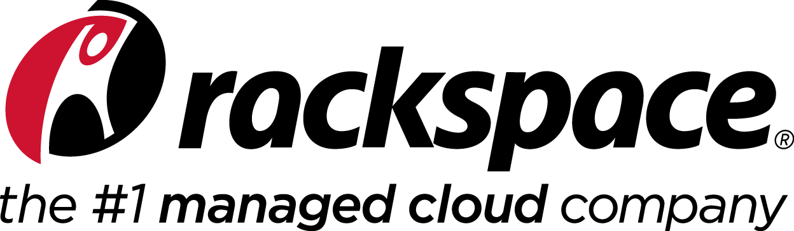

  

  <h1>Rackspace Cloud Code Challenge</h1>
  <h2>For Business Users</h2>
  
How well do YOU know the OpenStack® Programs?

1. Visit mycloud.rackspace.com
1. Log in with any one of the usernames and passwords below
1. Use one of the questions below to find the text file that contains the winning message:
  1. What was the previous name of this subatomic program that was renamed in July 2013?
  1. What was the previous name of this pirate’s treasure themed program that was renamed?
  1. What was the previous name of this grassy program that was recently renamed?
1. Select the container for the current OpenStack program name
1. Select the object (text file) for the previous OpenStack program name
1. Read the message inside the text file
1. Show a Racker and receive your free Scottevest pullover
