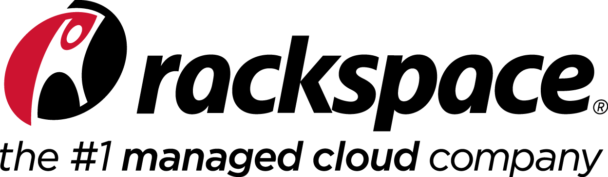

<b>Rackspace Cloud Code Challenge</b> For Developers

How well do YOU know the OpenStack® Programs?

1. Choose a software development kit (SDK) in the language of your choice:
  * Java
  * Python
  * Ruby
  * (we also have SDKs in .NET, Node.js, and PHP that are not part of this challenge)
1. Use the SDK handout for that language.
1. Use one of the questions below to find the text file that contains the winning message:
  * What was the previous name of this subatomic program that was renamed in July 2013?
  * What was the previous name of this pirate’s treasure themed program that was renamed?
  * What was the previous name of this grassy program that was recently renamed?
1. Visit [developer.rackspace.com](https://developer.rackspace.com/) to learn more about all of the SDKs and the developer+ program
